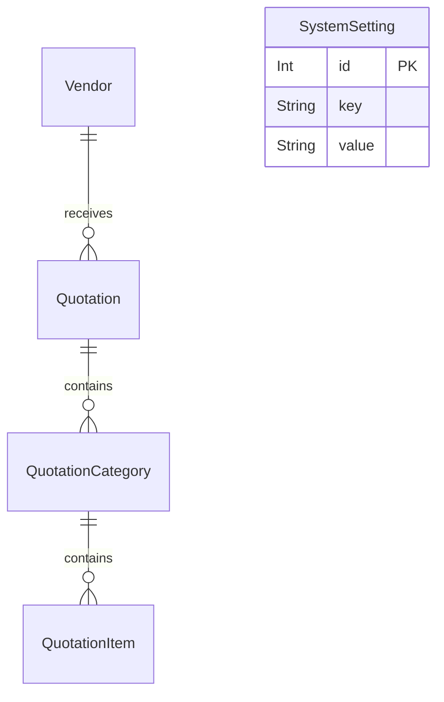

# 廠商收費報價系統設計文件 (Vendor Quotation System Design Document)

**日期**：2026-07-08  
**作者**：Lead Developer / Architect (Antigravity)  
**狀態**：DRAFT (等待審查)  

---

## 1. 專案概述 (Project Overview)
本專案旨在建立一個制式化的**廠商收費報價系統**，提供從前端報價單編輯、工時/整合度填寫、資料庫持久化儲存，到最後輸出成精美 HTML/PDF 的完整流程。
本系統特別針對軟體開發專案的特性，將每個功能細項區分為 **RD (研發)**、**PM (專案管理)**、**QC (品質控制)** 與 **Integration (系統整合)** 四個維度的每日工時，並根據系統設定的費率自動計算金額。

---

## 2. 系統架構與部署策略 (System Architecture & Deployment)

### 2.1 技術棧 (Tech Stack)
*   **前端與 API 路由**：Next.js 14+ App Router (React, Tailwind CSS / Vanilla CSS)
*   **資料庫 ORM**：Prisma ORM
*   **資料庫**：
    *   *本地開發*：SQLite (本地檔案資料庫，無安裝門檻)
    *   *生產環境*：Neon Serverless PostgreSQL (免費額度，適合 Vercel Serverless 環境)
*   **部署平台**：
    *   *代碼託管*：GitHub
    *   *應用託管*：Vercel

### 2.2 雙環境資料庫適配設計
為了解決 Vercel Serverless Function 唯讀且暫存的限制，我們將資料庫連線設定為動態適配：
```prisma
// prisma/schema.prisma
datasource db {
  provider = "postgresql" // 部署至 Vercel 時使用 PostgreSQL
  url      = env("DATABASE_URL")
}
```
*本地開發時，若想切換為 SQLite，我們可以使用額外的 `schema.sqlite.prisma` 或在本地使用 docker-compose 執行 PostgreSQL 以保持 Schema 一致。推薦在本地也直接使用 Docker 運行 PostgreSQL，或透過環境變數直接連線至 Neon 測試資料庫，以確保環境一致性。*

---

## 3. 資料庫 Schema 設計 (Database Schema)

基於 Prisma ORM，本系統規劃 5 張核心資料表：



### 3.1 `Vendor` (廠商資料表)
儲存合作廠商的基本聯絡與統編資訊。
*   `id`: `String` (UUID, PK)
*   `name`: `String` (廠商名稱，例如：*超極限科技股份有限公司*)
*   `taxId`: `String` (統一編號，8碼)
*   `contactName`: `String` (聯絡人姓名)
*   `contactEmail`: `String` (聯絡人信箱)
*   `contactPhone`: `String` (聯絡人電話，可空)
*   `address`: `String` (聯絡地址，可空)
*   `createdAt` / `updatedAt`: `DateTime`

### 3.2 `Quotation` (報價單主表)
記錄報價單的基本屬性與本張報價單生效時的角色費率。
*   `id`: `String` (UUID, PK)
*   `quotationNumber`: `String` (唯一單號，格式如 `Q-YYYYMMDD-XXX`)
*   `title`: `String` (專案報價名稱，例如：*電商官網開發案*)
*   `vendorId`: `String` (FK, 關聯 Vendor.id)
*   `status`: `String` (狀態：`DRAFT` 草稿, `SENT` 已送出, `ACCEPTED` 已接受, `REJECTED` 已拒絕)
*   `taxRate`: `Float` (稅率，預設 0.05 代表 5%)
*   **角色每日費率 (TWD/天)**：
    *   `rdRate`: `Int` (預設 8,000)
    *   `pmRate`: `Int` (預設 6,000)
    *   `qcRate`: `Int` (預設 5,000)
    *   `integrationRate`: `Int` (預設 6,500)
*   `createdAt` / `updatedAt`: `DateTime`

### 3.3 `QuotationCategory` (功能大項表)
劃分報價單的功能區塊。
*   `id`: `String` (UUID, PK)
*   `quotationId`: `String` (FK, 關聯 Quotation.id)
*   `name`: `String` (大項名稱，例如：*會員系統*、*購物車系統*)
*   `sortOrder`: `Int` (排序權重)

### 3.4 `QuotationItem` (功能細項表)
儲存最細緻的開發項目、工時評估與整合工時。
*   `id`: `String` (UUID, PK)
*   `categoryId`: `String` (FK, 關聯 QuotationCategory.id)
*   `description`: `String` (細項描述，例如：*Google OAuth 第三方登入串接*)
*   **工時估算 (單位：天，支援 0.5 天等小數)**：
    *   `rdDays`: `Float` (RD 工時)
    *   `pmDays`: `Float` (PM 工時)
    *   `qcDays`: `Float` (QC 工時)
    *   `integrationDays`: `Float` (系統整合工時)
*   `note`: `String` (備註，可空)
*   `sortOrder`: `Int` (排序權重)

### 3.5 `SystemSetting` (系統全域設定表)
用以存放全域預設的角色費率。
*   `id`: `Int` (PK, Auto Increment)
*   `key`: `String` (唯一鍵，例如：`DEFAULT_RD_RATE`)
*   `value`: `String` (設定值)

---

## 4. 計算公式與報價邏輯 (Calculation & Business Logic)

對於每一筆報價細項 (`QuotationItem`)，金額與工時計算如下：
1.  **細項總工時 (天)** = `rdDays + pmDays + qcDays + integrationDays`
2.  **細項未稅金額 (TWD)** = `(rdDays * rdRate) + (pmDays * pmRate) + (qcDays * qcRate) + (integrationDays * integrationRate)`
3.  **報價單未稅總額** = 該報價單下所有細項之「細項未稅金額」加總。
4.  **營業稅額** = `報價單未稅總額 * taxRate` (四捨五入至整數)。
5.  **報價單含稅總額** = `報價單未稅總額 + 營業稅額`。

---

## 5. 前端 UI 畫面與操作流程 (Frontend UI & Workflows)

### 5.1 儀表板頁面 (Dashboard / `/`)
*   **報價單列表**：表格顯示單號、專案名稱、廠商、含稅總金額、狀態與建立時間。
*   **操作按鈕**：
    *   「新增報價單」按鈕。
    *   「廠商管理」與「全域費率設定」快速入口。
    *   列表項目提供「編輯」、「刪除」、「匯出 PDF/HTML` 操作。

### 5.2 報價單編輯頁面 (`/quotations/new` 或 `/quotations/[id]/edit`)
*   **基本資訊卡片**：
    *   專案名稱輸入框。
    *   廠商下拉選單（選擇後自動在右側顯示統編與聯絡資訊）。
*   **大項與細項動態表格**：
    *   可動態「新增大項」。
    *   在大項下可「新增細項」，細項欄位包括：描述、RD天數、PM天數、QC天數、整合天數、備註。
    *   每一欄工時輸入數值時，前端即時透過 React State 計算並顯示該細項的「工時加總」與「預估金額」。
*   **費率微調區**：
    *   顯示該張報價單目前套用的 `rdRate`、`pmRate`、`qcRate`、`integrationRate`，允許在此處微調，一旦修改，所有細項金額即時重新計算。
*   **金額總計欄**：
    *   顯示 RD/PM/QC/整合各自的總天數與總額。
    *   顯示「未稅總計」、「稅額 (5%)」與「含稅總計」。

### 5.3 廠商管理頁面 (`/vendors`)
*   提供廠商的 CRUD 介面，方便快速新增、編輯合作廠商的統編與聯絡資訊。

---

## 6. HTML/PDF 輸出設計 (HTML/PDF Export)

本系統採用 **Print-friendly HTML** 搭配瀏覽器原生 `window.print()` 的方案，這是實作最乾淨、最不容易跑版且能完美渲染中文字型的解決方案。

### 6.1 輸出版面規劃
*   **頁首區**：公司名稱、公司聯絡資訊、報價單大標題、報價日期與單號。
*   **客戶資訊區**：客戶抬頭、聯絡人、統一編號、聯絡電話。
*   **報價明細表 (制式化 HTML 表格)**：
    *   欄位：項次、功能項目/描述、RD工時、PM工時、QC工時、整合工時、小計金額。
    *   使用 `QuotationCategory` 將表格進行視覺分組。
*   **總計與簽章區**：
    *   顯示總工時明細與含稅總金額。
    *   底部預留雙方公司的簽章欄位（「廠商簽認」與「我方簽認」）。

### 6.2 Print CSS 最佳化策略
*   使用 `@media print` 隱藏系統的 Navigation Bar、按鈕與操作性表單欄位，僅顯示報價單主體。
*   使用 CSS `page-break-inside: avoid` 避免細項表格行被硬性跨頁截斷。
*   將輸入框 (`input`) 轉為純文字無邊框樣式，以符合列印的美觀。

---

## 7. 驗證與品質閘口 (Verification Gates)
*   **API 測試**：確保新增/編輯報價單時的計算邏輯有單元測試驗證，防止浮點數精度問題。
*   **資料一致性**：刪除廠商時，系統需防範或提示其關聯之報價單的處理方式。
